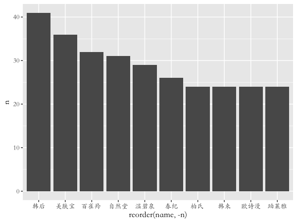
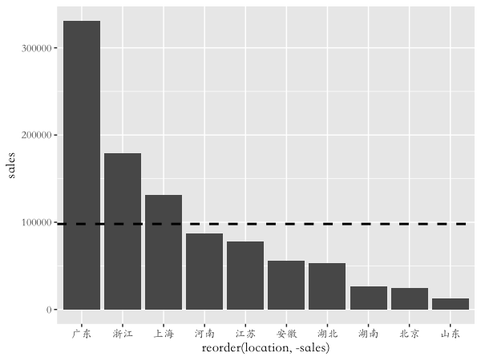
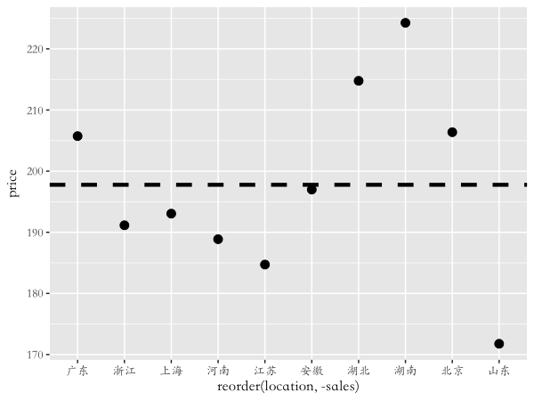
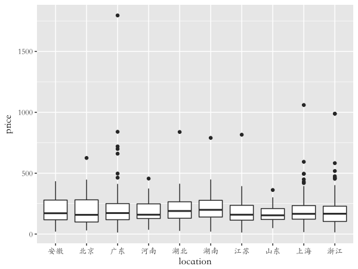

<style>
.title-slide {
  background-color: #F1FAFA; /* #EDE0CF; ; #CA9F9D*/
}
</style>


## 数据框 (`data.frame`)

<h3>
数据框是一种矩阵形式的数据, 数据框中各列可以是不同类型对的数据.
</h3>

- <h3>每行是一个观测</h3>
- <h3>每列是一个变量</h3>


```r
library(nycflights13)
class(flights)
```

```
[1] "tbl_df"     "tbl"        "data.frame"
```

```r
dim(flights)
```

```
[1] 336776     19
```

---


```r
xtable(head(flights[,1:9], 5))
```

<!-- html table generated in R 3.3.2 by xtable 1.8-2 package -->
<!-- Wed Mar  1 18:02:59 2017 -->
<table border=1>
<tr> <th>  </th> <th> year </th> <th> month </th> <th> day </th> <th> dep_time </th> <th> sched_dep_time </th> <th> dep_delay </th> <th> arr_time </th> <th> sched_arr_time </th> <th> arr_delay </th>  </tr>
  <tr> <td align="right"> 1 </td> <td align="right"> 2013 </td> <td align="right">   1 </td> <td align="right">   1 </td> <td align="right"> 517 </td> <td align="right"> 515 </td> <td align="right"> 2.00 </td> <td align="right"> 830 </td> <td align="right"> 819 </td> <td align="right"> 11.00 </td> </tr>
  <tr> <td align="right"> 2 </td> <td align="right"> 2013 </td> <td align="right">   1 </td> <td align="right">   1 </td> <td align="right"> 533 </td> <td align="right"> 529 </td> <td align="right"> 4.00 </td> <td align="right"> 850 </td> <td align="right"> 830 </td> <td align="right"> 20.00 </td> </tr>
  <tr> <td align="right"> 3 </td> <td align="right"> 2013 </td> <td align="right">   1 </td> <td align="right">   1 </td> <td align="right"> 542 </td> <td align="right"> 540 </td> <td align="right"> 2.00 </td> <td align="right"> 923 </td> <td align="right"> 850 </td> <td align="right"> 33.00 </td> </tr>
  <tr> <td align="right"> 4 </td> <td align="right"> 2013 </td> <td align="right">   1 </td> <td align="right">   1 </td> <td align="right"> 544 </td> <td align="right"> 545 </td> <td align="right"> -1.00 </td> <td align="right"> 1004 </td> <td align="right"> 1022 </td> <td align="right"> -18.00 </td> </tr>
  <tr> <td align="right"> 5 </td> <td align="right"> 2013 </td> <td align="right">   1 </td> <td align="right">   1 </td> <td align="right"> 554 </td> <td align="right"> 600 </td> <td align="right"> -6.00 </td> <td align="right"> 812 </td> <td align="right"> 837 </td> <td align="right"> -25.00 </td> </tr>
   </table>

```r
xtable(head(flights[,10:19], 5))
```

<!-- html table generated in R 3.3.2 by xtable 1.8-2 package -->
<!-- Wed Mar  1 18:02:59 2017 -->
<table border=1>
<tr> <th>  </th> <th> carrier </th> <th> flight </th> <th> tailnum </th> <th> origin </th> <th> dest </th> <th> air_time </th> <th> distance </th> <th> hour </th> <th> minute </th> <th> time_hour </th>  </tr>
  <tr> <td align="right"> 1 </td> <td> UA </td> <td align="right"> 1545 </td> <td> N14228 </td> <td> EWR </td> <td> IAH </td> <td align="right"> 227.00 </td> <td align="right"> 1400.00 </td> <td align="right"> 5.00 </td> <td align="right"> 15.00 </td> <td align="right"> 1357016400.00 </td> </tr>
  <tr> <td align="right"> 2 </td> <td> UA </td> <td align="right"> 1714 </td> <td> N24211 </td> <td> LGA </td> <td> IAH </td> <td align="right"> 227.00 </td> <td align="right"> 1416.00 </td> <td align="right"> 5.00 </td> <td align="right"> 29.00 </td> <td align="right"> 1357016400.00 </td> </tr>
  <tr> <td align="right"> 3 </td> <td> AA </td> <td align="right"> 1141 </td> <td> N619AA </td> <td> JFK </td> <td> MIA </td> <td align="right"> 160.00 </td> <td align="right"> 1089.00 </td> <td align="right"> 5.00 </td> <td align="right"> 40.00 </td> <td align="right"> 1357016400.00 </td> </tr>
  <tr> <td align="right"> 4 </td> <td> B6 </td> <td align="right"> 725 </td> <td> N804JB </td> <td> JFK </td> <td> BQN </td> <td align="right"> 183.00 </td> <td align="right"> 1576.00 </td> <td align="right"> 5.00 </td> <td align="right"> 45.00 </td> <td align="right"> 1357016400.00 </td> </tr>
  <tr> <td align="right"> 5 </td> <td> DL </td> <td align="right"> 461 </td> <td> N668DN </td> <td> LGA </td> <td> ATL </td> <td align="right"> 116.00 </td> <td align="right"> 762.00 </td> <td align="right"> 6.00 </td> <td align="right"> 0.00 </td> <td align="right"> 1357020000.00 </td> </tr>
   </table>

---

## `dplyr` 常用函数

- `filter()` (`slice()`)
- `arrange()`
- `select()` (`rename()`)
- `distinct()`
- `mutate()` (`transmute()`)
- `summarise()`
- `sample_n()` (`sample_frac()`)
- `group_by()`
- `%>%`

---

## 使用 `filter()` 来过滤行

例如, 我们想选择1月1号的所有航班


```r
library(dplyr)
filter(flights, month == 1, day == 1)
```

```
# A tibble: 842 × 19
    year month   day dep_time sched_dep_time dep_delay arr_time sched_arr_time arr_delay carrier
   <int> <int> <int>    <int>          <int>     <dbl>    <int>          <int>     <dbl>   <chr>
1   2013     1     1      517            515         2      830            819        11      UA
2   2013     1     1      533            529         4      850            830        20      UA
3   2013     1     1      542            540         2      923            850        33      AA
4   2013     1     1      544            545        -1     1004           1022       -18      B6
5   2013     1     1      554            600        -6      812            837       -25      DL
6   2013     1     1      554            558        -4      740            728        12      UA
7   2013     1     1      555            600        -5      913            854        19      B6
8   2013     1     1      557            600        -3      709            723       -14      EV
9   2013     1     1      557            600        -3      838            846        -8      B6
10  2013     1     1      558            600        -2      753            745         8      AA
# ... with 832 more rows, and 9 more variables: flight <int>, tailnum <chr>, origin <chr>,
#   dest <chr>, air_time <dbl>, distance <dbl>, hour <dbl>, minute <dbl>, time_hour <dttm>
```

这等价于


```r
flights[flights$month == 1 & flights$day == 1, ]
```

---

- 选择1月或2月的所有航班


```r
filter(flights, month == 1 | month == 2)
```

- 如果想按照位置选择行, 可用 `slice()`


```r
slice(flights, 1:5)
```

```
# A tibble: 5 × 19
   year month   day dep_time sched_dep_time dep_delay arr_time sched_arr_time arr_delay carrier
  <int> <int> <int>    <int>          <int>     <dbl>    <int>          <int>     <dbl>   <chr>
1  2013     1     1      517            515         2      830            819        11      UA
2  2013     1     1      533            529         4      850            830        20      UA
3  2013     1     1      542            540         2      923            850        33      AA
4  2013     1     1      544            545        -1     1004           1022       -18      B6
5  2013     1     1      554            600        -6      812            837       -25      DL
# ... with 9 more variables: flight <int>, tailnum <chr>, origin <chr>, dest <chr>, air_time <dbl>,
#   distance <dbl>, hour <dbl>, minute <dbl>, time_hour <dttm>
```

---

## 使用 `arrange()` 对行进行排序

- 按年、月、日对航班进行排序


```r
arrange(flights , year, month, day)
```

```
# A tibble: 336,776 × 19
    year month   day dep_time sched_dep_time dep_delay arr_time sched_arr_time arr_delay carrier
   <int> <int> <int>    <int>          <int>     <dbl>    <int>          <int>     <dbl>   <chr>
1   2013     1     1      517            515         2      830            819        11      UA
2   2013     1     1      533            529         4      850            830        20      UA
3   2013     1     1      542            540         2      923            850        33      AA
4   2013     1     1      544            545        -1     1004           1022       -18      B6
5   2013     1     1      554            600        -6      812            837       -25      DL
6   2013     1     1      554            558        -4      740            728        12      UA
7   2013     1     1      555            600        -5      913            854        19      B6
8   2013     1     1      557            600        -3      709            723       -14      EV
9   2013     1     1      557            600        -3      838            846        -8      B6
10  2013     1     1      558            600        -2      753            745         8      AA
# ... with 336,766 more rows, and 9 more variables: flight <int>, tailnum <chr>, origin <chr>,
#   dest <chr>, air_time <dbl>, distance <dbl>, hour <dbl>, minute <dbl>, time_hour <dttm>
```

---

- 使用 `desc()` 对一列以降序排序


```r
arrange(flights, desc(dep_delay))
```

```
# A tibble: 336,776 × 19
    year month   day dep_time sched_dep_time dep_delay arr_time sched_arr_time arr_delay carrier
   <int> <int> <int>    <int>          <int>     <dbl>    <int>          <int>     <dbl>   <chr>
1   2013     1     9      641            900      1301     1242           1530      1272      HA
2   2013     6    15     1432           1935      1137     1607           2120      1127      MQ
3   2013     1    10     1121           1635      1126     1239           1810      1109      MQ
4   2013     9    20     1139           1845      1014     1457           2210      1007      AA
5   2013     7    22      845           1600      1005     1044           1815       989      MQ
6   2013     4    10     1100           1900       960     1342           2211       931      DL
7   2013     3    17     2321            810       911      135           1020       915      DL
8   2013     6    27      959           1900       899     1236           2226       850      DL
9   2013     7    22     2257            759       898      121           1026       895      DL
10  2013    12     5      756           1700       896     1058           2020       878      AA
# ... with 336,766 more rows, and 9 more variables: flight <int>, tailnum <chr>, origin <chr>,
#   dest <chr>, air_time <dbl>, distance <dbl>, hour <dbl>, minute <dbl>, time_hour <dttm>
```

--- &vcenter

- 上面代码等价于


```r
flights[order(flights$year, flights$month, flights$day), ]

flights[order(flights$dep_delay, decreasing = TRUE), ] 
#flights[order(-flights$arr_delay), ]
```

---

## 使用 `select()` 选择列

- 通过变量名选择列


```r
select(flights, year, month, day)
```

```
# A tibble: 336,776 × 3
    year month   day
   <int> <int> <int>
1   2013     1     1
2   2013     1     1
3   2013     1     1
4   2013     1     1
5   2013     1     1
6   2013     1     1
7   2013     1     1
8   2013     1     1
9   2013     1     1
10  2013     1     1
# ... with 336,766 more rows
```

---

- 选择两个变量间的所有变量


```r
select(flights, year:day)
```

```
# A tibble: 336,776 × 3
    year month   day
   <int> <int> <int>
1   2013     1     1
2   2013     1     1
3   2013     1     1
4   2013     1     1
5   2013     1     1
6   2013     1     1
7   2013     1     1
8   2013     1     1
9   2013     1     1
10  2013     1     1
# ... with 336,766 more rows
```

---

- 选择除了某些变量外的所有变量


```r
select(flights, -(year:day)) #select(flights, -c(year, month, day))
```

```
# A tibble: 336,776 × 16
   dep_time sched_dep_time dep_delay arr_time sched_arr_time arr_delay carrier flight tailnum
      <int>          <int>     <dbl>    <int>          <int>     <dbl>   <chr>  <int>   <chr>
1       517            515         2      830            819        11      UA   1545  N14228
2       533            529         4      850            830        20      UA   1714  N24211
3       542            540         2      923            850        33      AA   1141  N619AA
4       544            545        -1     1004           1022       -18      B6    725  N804JB
5       554            600        -6      812            837       -25      DL    461  N668DN
6       554            558        -4      740            728        12      UA   1696  N39463
7       555            600        -5      913            854        19      B6    507  N516JB
8       557            600        -3      709            723       -14      EV   5708  N829AS
9       557            600        -3      838            846        -8      B6     79  N593JB
10      558            600        -2      753            745         8      AA    301  N3ALAA
# ... with 336,766 more rows, and 7 more variables: origin <chr>, dest <chr>, air_time <dbl>,
#   distance <dbl>, hour <dbl>, minute <dbl>, time_hour <dttm>
```

--- &vcenter

- 在使用 `select()` 时有一些函数会很有帮助
    - `starts_with()`
    - `ends_with()`
    - `matches()`
    - `contains()`
    

```r
select(flights, contains("dep"))
```

--- &twocol

## 使用 `distinct()` 提取不重复的行

*** =left


```r
distinct(flights, tailnum)
```

```
# A tibble: 4,044 × 1
   tailnum
     <chr>
1   N14228
2   N24211
3   N619AA
4   N804JB
5   N668DN
6   N39463
7   N516JB
8   N829AS
9   N593JB
10  N3ALAA
# ... with 4,034 more rows
```

*** =right


```r
distinct(flights, origin, dest)
```

```
# A tibble: 224 × 2
   origin  dest
    <chr> <chr>
1     EWR   IAH
2     LGA   IAH
3     JFK   MIA
4     JFK   BQN
5     LGA   ATL
6     EWR   ORD
7     EWR   FLL
8     LGA   IAD
9     JFK   MCO
10    LGA   ORD
# ... with 214 more rows
```

---

## 使用 `mutate()` 创建新列


```r
mutate(flights, gain = arr_delay - dep_delay, 
       speed = distance / air_time *60)
```

```
# A tibble: 336,776 × 21
    year month   day dep_time sched_dep_time dep_delay arr_time sched_arr_time arr_delay carrier
   <int> <int> <int>    <int>          <int>     <dbl>    <int>          <int>     <dbl>   <chr>
1   2013     1     1      517            515         2      830            819        11      UA
2   2013     1     1      533            529         4      850            830        20      UA
3   2013     1     1      542            540         2      923            850        33      AA
4   2013     1     1      544            545        -1     1004           1022       -18      B6
5   2013     1     1      554            600        -6      812            837       -25      DL
6   2013     1     1      554            558        -4      740            728        12      UA
7   2013     1     1      555            600        -5      913            854        19      B6
8   2013     1     1      557            600        -3      709            723       -14      EV
9   2013     1     1      557            600        -3      838            846        -8      B6
10  2013     1     1      558            600        -2      753            745         8      AA
# ... with 336,766 more rows, and 11 more variables: flight <int>, tailnum <chr>, origin <chr>,
#   dest <chr>, air_time <dbl>, distance <dbl>, hour <dbl>, minute <dbl>, time_hour <dttm>,
#   gain <dbl>, speed <dbl>
```

--- 

### 如果只想保留新创建的变量


```r
transmute(flights, gain = arr_delay - dep_delay, 
       speed = distance / air_time *60)
```

```
# A tibble: 336,776 × 2
    gain speed
   <dbl> <dbl>
1      9   370
2     16   374
3     31   408
4    -17   517
5    -19   394
6     16   288
7     24   404
8    -11   259
9     -5   405
10    10   319
# ... with 336,766 more rows
```


---

## 使用 `summarise()` 进行汇总


```r
summarise(flights, dep_delay = mean(dep_delay, na.rm = TRUE))
```

```
# A tibble: 1 × 1
  dep_delay
      <dbl>
1      12.6
```

---

## 随机选择一些行 `sample_n()`, `sample_frac()`


```r
sample_n(flights, 3)
```

```
# A tibble: 3 × 19
   year month   day dep_time sched_dep_time dep_delay arr_time sched_arr_time arr_delay carrier
  <int> <int> <int>    <int>          <int>     <dbl>    <int>          <int>     <dbl>   <chr>
1  2013     7    16     1939           1930         9     2058           2112       -14      9E
2  2013    10    18      751            758        -7     1016           1020        -4      UA
3  2013     6    28      555            600        -5      650            659        -9      US
# ... with 9 more variables: flight <int>, tailnum <chr>, origin <chr>, dest <chr>, air_time <dbl>,
#   distance <dbl>, hour <dbl>, minute <dbl>, time_hour <dttm>
```

---


```r
sample_frac(flights, 0.01)
```

```
# A tibble: 3,368 × 19
    year month   day dep_time sched_dep_time dep_delay arr_time sched_arr_time arr_delay carrier
   <int> <int> <int>    <int>          <int>     <dbl>    <int>          <int>     <dbl>   <chr>
1   2013     9    13     1817           1825        -8     2051           2121       -30      DL
2   2013     3     5      838            820        18     1148           1124        24      B6
3   2013     1     4     2117           2118        -1     2221           2217         4      EV
4   2013    10    21     1239           1249       -10     1346           1352        -6      B6
5   2013    10     9     1445           1444         1     1606           1624       -18      9E
6   2013     3     9     1644           1645        -1     1924           2000       -36      B6
7   2013     5     5      849            900       -11     1139           1225       -46      AA
8   2013     8     4     1753           1755        -2     1916           1921        -5      B6
9   2013     1    23     1055           1100        -5     1204           1215       -11      MQ
10  2013    12     6     1406           1355        11     1746           1715        31      US
# ... with 3,358 more rows, and 9 more variables: flight <int>, tailnum <chr>, origin <chr>,
#   dest <chr>, air_time <dbl>, distance <dbl>, hour <dbl>, minute <dbl>, time_hour <dttm>
```

---

## 分组运算 `group_by()`

找出所有飞机中飞行次数20次以上, 且平均飞行距离小于 2000 的飞机的平均飞行距离和平均晚点抵达时间


```r
by_tailnum <- group_by(flights, tailnum)
delay <- summarise(by_tailnum,
  count = n(), #n() 返回行数
  dist = mean(distance, na.rm = TRUE),
  delay = mean(arr_delay, na.rm = TRUE))
delay <- filter(delay, count > 20, dist < 2000)
```

--- &vcenter


```r
xtable(head(delay,10))
```

<!-- html table generated in R 3.3.2 by xtable 1.8-2 package -->
<!-- Wed Mar  1 18:03:01 2017 -->
<table border=1>
<tr> <th>  </th> <th> tailnum </th> <th> count </th> <th> dist </th> <th> delay </th>  </tr>
  <tr> <td align="right"> 1 </td> <td> N0EGMQ </td> <td align="right"> 371 </td> <td align="right"> 676.19 </td> <td align="right"> 9.98 </td> </tr>
  <tr> <td align="right"> 2 </td> <td> N10156 </td> <td align="right"> 153 </td> <td align="right"> 757.95 </td> <td align="right"> 12.72 </td> </tr>
  <tr> <td align="right"> 3 </td> <td> N102UW </td> <td align="right">  48 </td> <td align="right"> 535.88 </td> <td align="right"> 2.94 </td> </tr>
  <tr> <td align="right"> 4 </td> <td> N103US </td> <td align="right">  46 </td> <td align="right"> 535.20 </td> <td align="right"> -6.93 </td> </tr>
  <tr> <td align="right"> 5 </td> <td> N104UW </td> <td align="right">  47 </td> <td align="right"> 535.26 </td> <td align="right"> 1.80 </td> </tr>
  <tr> <td align="right"> 6 </td> <td> N10575 </td> <td align="right"> 289 </td> <td align="right"> 519.70 </td> <td align="right"> 20.69 </td> </tr>
  <tr> <td align="right"> 7 </td> <td> N105UW </td> <td align="right">  45 </td> <td align="right"> 524.84 </td> <td align="right"> -0.27 </td> </tr>
  <tr> <td align="right"> 8 </td> <td> N107US </td> <td align="right">  41 </td> <td align="right"> 528.71 </td> <td align="right"> -5.73 </td> </tr>
  <tr> <td align="right"> 9 </td> <td> N108UW </td> <td align="right">  60 </td> <td align="right"> 534.50 </td> <td align="right"> -1.25 </td> </tr>
  <tr> <td align="right"> 10 </td> <td> N109UW </td> <td align="right">  48 </td> <td align="right"> 535.88 </td> <td align="right"> -2.52 </td> </tr>
   </table>

---

找出所有可能目的地的飞机数和航班数


```r
dest = group_by(flights, dest)
summarise(dest, 
          planes = n_distinct(tailnum),
          flights = n()
)
```

```
# A tibble: 105 × 3
    dest planes flights
   <chr>  <int>   <int>
1    ABQ    108     254
2    ACK     58     265
3    ALB    172     439
4    ANC      6       8
5    ATL   1180   17215
6    AUS    993    2439
7    AVL    159     275
8    BDL    186     443
9    BGR     46     375
10   BHM     45     297
# ... with 95 more rows
```

---

## 按多个变量进行分组


```r
daily <- group_by(flights, year, month, day)
(per_day   <- summarise(daily, flights = n()))
```

```
Source: local data frame [365 x 4]
Groups: year, month [?]

    year month   day flights
   <int> <int> <int>   <int>
1   2013     1     1     842
2   2013     1     2     943
3   2013     1     3     914
4   2013     1     4     915
5   2013     1     5     720
6   2013     1     6     832
7   2013     1     7     933
8   2013     1     8     899
9   2013     1     9     902
10  2013     1    10     932
# ... with 355 more rows
```

---


```r
(per_month <- summarise(per_day, flights = sum(flights)))
```

```
Source: local data frame [12 x 3]
Groups: year [?]

    year month flights
   <int> <int>   <int>
1   2013     1   27004
2   2013     2   24951
3   2013     3   28834
4   2013     4   28330
5   2013     5   28796
6   2013     6   28243
7   2013     7   29425
8   2013     8   29327
9   2013     9   27574
10  2013    10   28889
11  2013    11   27268
12  2013    12   28135
```

---


```r
(per_year  <- summarise(per_month, flights = sum(flights)))
```

```
# A tibble: 1 × 2
   year flights
  <int>   <int>
1  2013  336776
```

--- &twocol

## `%>%`: 链式运算

找出日平均起飞延迟时间或平均抵达延迟时间大于30的日期

*** =left


```r
a1 <- group_by(flights, year, month, day)
a2 <- select(a1, arr_delay, dep_delay)
a3 <- summarise(a2,
  arr = mean(arr_delay, na.rm = TRUE),
  dep = mean(dep_delay, na.rm = TRUE))
a4 <- filter(a3, arr > 30 | dep > 30)
```

*** =right


```r
filter(
  summarise(
    select(
      group_by(flights, year, month, day),
      arr_delay, dep_delay
    ),
    arr = mean(arr_delay, na.rm = TRUE),
    dep = mean(dep_delay, na.rm = TRUE)
  ),
  arr > 30 | dep > 30
)
```


--- &twocol

*** =left


```r
flights %>%
  group_by(year, month, day) %>%
  select(arr_delay, dep_delay) %>%
  summarise(
    arr = mean(arr_delay, na.rm = TRUE),
    dep = mean(dep_delay, na.rm = TRUE)
  ) %>%
  filter(arr > 30 | dep > 30)
```

*** =right


```
Source: local data frame [49 x 5]
Groups: year, month [11]

    year month   day   arr   dep
   <int> <int> <int> <dbl> <dbl>
1   2013     1    16  34.2  24.6
2   2013     1    31  32.6  28.7
3   2013     2    11  36.3  39.1
4   2013     2    27  31.3  37.8
5   2013     3     8  85.9  83.5
6   2013     3    18  41.3  30.1
7   2013     4    10  38.4  33.0
8   2013     4    12  36.0  34.8
9   2013     4    18  36.0  34.9
10  2013     4    19  47.9  46.1
# ... with 39 more rows
```

---

## 面膜销售分析


```r
library(readxl)
mask = read_excel("mask_data_cleaned.xlsx")   ## 读取原始数据
xtable(head(mask))
```

<!-- html table generated in R 3.3.2 by xtable 1.8-2 package -->
<!-- Wed Mar  1 18:03:02 2017 -->
<table border=1>
<tr> <th>  </th> <th> name </th> <th> price </th> <th> sales </th> <th> reviews </th> <th> location </th> <th> type </th> <th> country </th> <th> 补水保湿 </th> <th> 美白提亮 </th> <th> 控油祛痘 </th> <th> 清洁毛孔 </th> <th> 提拉紧致 </th>  </tr>
  <tr> <td align="right"> 1 </td> <td> ANGLEE </td> <td align="right"> 254.00 </td> <td align="right"> 40.00 </td> <td align="right"> 3133.00 </td> <td> 湖南 </td> <td> 任何肤质 </td> <td> 中国 </td> <td align="right"> 1.00 </td> <td align="right"> 1.00 </td> <td align="right"> 0.00 </td> <td align="right"> 0.00 </td> <td align="right"> 0.00 </td> </tr>
  <tr> <td align="right"> 2 </td> <td> ANGLEE </td> <td align="right"> 350.00 </td> <td align="right"> 62.00 </td> <td align="right"> 876.00 </td> <td> 浙江 </td> <td> 任何肤质 </td> <td> 中国 </td> <td align="right"> 1.00 </td> <td align="right"> 1.00 </td> <td align="right"> 0.00 </td> <td align="right"> 0.00 </td> <td align="right"> 0.00 </td> </tr>
  <tr> <td align="right"> 3 </td> <td> ANGLEE </td> <td align="right"> 284.90 </td> <td align="right"> 12.00 </td> <td align="right"> 16.00 </td> <td> 浙江 </td> <td> 任何肤质 </td> <td> 中国 </td> <td align="right"> 1.00 </td> <td align="right"> 0.00 </td> <td align="right"> 1.00 </td> <td align="right"> 1.00 </td> <td align="right"> 0.00 </td> </tr>
  <tr> <td align="right"> 4 </td> <td> BF </td> <td align="right"> 289.00 </td> <td align="right"> 32.00 </td> <td align="right"> 175.00 </td> <td> 英国 </td> <td> 任何肤质 </td> <td> 中国 </td> <td align="right"> 1.00 </td> <td align="right"> 0.00 </td> <td align="right"> 0.00 </td> <td align="right"> 0.00 </td> <td align="right"> 0.00 </td> </tr>
  <tr> <td align="right"> 5 </td> <td> BSR </td> <td align="right"> 379.90 </td> <td align="right"> 1407.00 </td> <td align="right"> 13870.00 </td> <td> 安徽 </td> <td> 任何肤质 </td> <td> 中国 </td> <td align="right"> 1.00 </td> <td align="right"> 0.00 </td> <td align="right"> 0.00 </td> <td align="right"> 0.00 </td> <td align="right"> 0.00 </td> </tr>
  <tr> <td align="right"> 6 </td> <td> BSR </td> <td align="right"> 345.00 </td> <td align="right"> 318.00 </td> <td align="right"> 391.00 </td> <td> 安徽 </td> <td> 任何肤质 </td> <td> 日本 </td> <td align="right"> 1.00 </td> <td align="right"> 0.00 </td> <td align="right"> 0.00 </td> <td align="right"> 0.00 </td> <td align="right"> 0.00 </td> </tr>
   </table>

--- &twocol

### 面膜品牌分析


```r
#选取最受欢迎的前10品牌
name_top10 = mask %>%
              group_by(name) %>%
              summarise(n = n()) %>%
              filter(row_number(desc(n)) <= 10)
```


```r
#使用 ggplot2 包绘制图形
library(ggplot2)
# geom_bar: 绘制柱形图
ggplot(name_top10, aes(x = reorder(name, -n), y = n)) +
  geom_bar(stat="identity") + 
  theme(text = element_text(family = "STKaiti", size = 12))
# theme(text = element_text(family = "STKaiti", size = 12)) 仅在 mac 系统时需要
```

--- &vcenter

<div class="rimage center"></div>

--- &vcenter


```r
#选取最受欢迎的前50品牌
name_top50 = mask %>%
  group_by(name) %>%
  summarise(n = n()) %>%
  filter(row_number(desc(n)) <= 50)

#使用 wordcloud2 包绘制词云
library(wordcloud2)
w = wordcloud2(as.data.frame(name_top50))
```

---

<div class="rimage center"></div>

---

## 哪个地方的面膜卖的最好?


```r
hot10 = mask %>%
    group_by(location) %>%
    summarise(sales = sum(sales), price = mean(price)) %>%
    filter(row_number(-sales) <= 10)
```


```r
#geom_hline: 画水平线
ggplot(hot10, aes(x = reorder(location, -sales), y = sales)) + 
  geom_bar(stat = "identity") + 
  geom_hline(aes(yintercept = mean(sales)), linetype = 2, size = 1) +
  theme(text = element_text(family = "STKaiti", size = 12))
```

--- &vcenter

<div class="rimage center"></div>

--- &vcenter


```r
ggplot(hot10, aes(x = reorder(location, -sales), y = price)) +
  geom_point(size = 3) + 
  geom_hline(aes(yintercept = mean(price)), linetype = 2, size = 1.5) +
  theme(text = element_text(family = "STKaiti", size = 12))
```

--- &vcenter

<div class="rimage center"></div>

--- &vcenter


```r
location_price = mask %>% 
  filter(location %in% hot10$location) %>%
  select(location, price)

#geom_boxplot: 绘制箱线图                    
ggplot(location_price, aes(x = location, y = price)) + 
  geom_boxplot() +
  theme(text = element_text(family = "STKaiti", size = 12))
```

--- &vcenter

<div class="rimage center"></div>

--- &vcenter


```r
xtable(filter(mask, price == max(price)))
```

<!-- html table generated in R 3.3.2 by xtable 1.8-2 package -->
<!-- Wed Mar  1 18:03:14 2017 -->
<table border=1>
<tr> <th>  </th> <th> name </th> <th> price </th> <th> sales </th> <th> reviews </th> <th> location </th> <th> type </th> <th> country </th> <th> 补水保湿 </th> <th> 美白提亮 </th> <th> 控油祛痘 </th> <th> 清洁毛孔 </th> <th> 提拉紧致 </th>  </tr>
  <tr> <td align="right"> 1 </td> <td> 七水 </td> <td align="right"> 1796.00 </td> <td align="right"> 4.00 </td> <td align="right"> 26.00 </td> <td> 广东 </td> <td> 任何肤质 </td> <td> 中国 </td> <td align="right"> 1.00 </td> <td align="right"> 1.00 </td> <td align="right"> 1.00 </td> <td align="right"> 1.00 </td> <td align="right"> 1.00 </td> </tr>
   </table>


```r
#geom_histogram: 绘制直方图
ggplot(filter(mask, location == "广东"), aes(x = price)) + 
  geom_histogram(binwidth = 50) +xlab("价格") + ylab("") +
  ggtitle("广东省面膜销售价格分布") +
  theme(text = element_text(family = "STKaiti", size = 12))
```

--- &vcenter

<div class="rimage center"></div>

